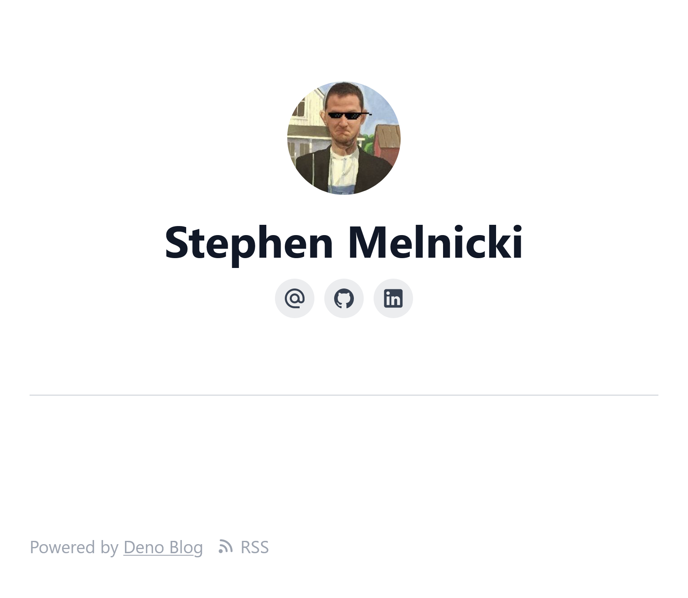

<picture>
  <source media="(prefers-color-scheme: dark)" srcset="./posts/screenshot_dark.png">
  
</picture>

# Stephen's Blog

To get started:

```
git clone git@github.com:stephenmelnicki/stephenmelnicki.com.git blog
cd blog
deno task dev
```

Built with [deno_blog](https://github.com/denoland/deno_blog).
